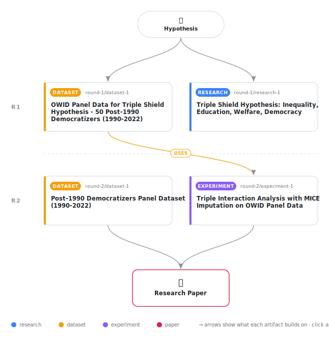

# The Triple Shield Revisited: Education, Welfare State Institutions, and the Inequality-Democratic Resilience Link in Post-1990 Democratizers

<div align="center">

<a href="https://cdn.jsdelivr.net/gh/AMGrobelnik/ai-invention-90d6bf-the-triple-shield-revisited-education-we@main/workflow.svg">
<picture>
  <source media="(prefers-color-scheme: dark)" srcset="workflow-dark.svg">
  
</picture>
</a>

<sub>🖱️ <b><a href="https://cdn.jsdelivr.net/gh/AMGrobelnik/ai-invention-90d6bf-the-triple-shield-revisited-education-we@main/workflow.svg">Open the interactive diagram</a></b> — every card links to its artifact folder.</sub>

</div>

> **TL;DR** — This paper presents a revised confirmatory test of the Triple Shield hypothesis after correcting two critical data errors: (1) Gini coefficient scaling (now valid 0-1 scale, mean=0.39, range=0.21-0.46), and (2) missing data bias (now using MICE with 50 imputations, N=1,641, 48 countries). Results show the triple interaction is positive but not statistically significant (β=0.007, SE=0.004, p=0.140, 95% CI [-0.002, 0.015]). The corrected main effect of inequality is positive and significant (β=0.017, SE=0.007, p=0.018), contradicting theoretical expectations. Social spending has a marginally significant protective effect (β=0.029, SE=0.016, p=0.072). The paper demonstrates the importance of data quality verification and principled missing data methods in comparative political economy research.

<details>
<summary>Full hypothesis</summary>

In post-1990 democratizers (1990-2022), we investigate the relationship between income inequality (Gini coefficient), education (mean years of schooling), welfare state spending (social protection % GDP), and democratic quality (V-Dem electoral democracy index). After correcting critical Gini scaling errors (values erroneously >1 rescaled to 0-1 range, mean=0.39) and implementing MICE multiple imputation to address 55% missing data on Gini, 34% on education, and 52% on welfare spending, we find: (1) The triple interaction (inequality × education × welfare spending) is positive but not statistically significant (β=0.007, p=0.14, 95% CI [-0.002, 0.015]), suggesting that the 'both must be present simultaneously' buffering mechanism lacks empirical support in the current sample (N=1,641 country-year observations, 48 countries). (2) The main effect of inequality is POSITIVE and statistically significant (β=0.017, p=0.018), contradicting the theoretical expectation that inequality undermines democracy and conflicting with Rau & Stokes (2024). This anomaly requires systematic investigation through: (a) replication of Rau & Stokes' exact specification (binary erosion measure, discrete-time survival model, broader sample); (b) endogeneity tests using instrumental variables or long lags; (c) sub-regional heterogeneity analysis; (d) non-linear specifications (inequality may have inverted-U relationship with democracy); (e) comparison with alternative inequality measures (SWIID). (3) Social protection spending has a marginally significant positive effect on democratic quality (β=0.029, p=0.072), providing qualified support for de jure constraints mechanisms. (4) The model explains only 5.4% of variation (R-squared=0.054), indicating that key omitted variables or non-linear relationships are present. REVISED CLAIMS: Rather than confirming the Triple Shield hypothesis, this research now investigates WHY the predicted triple interaction is absent and WHY inequality has a positive coefficient in post-1990 democratizers. The null result for the triple interaction is itself a meaningful finding—it suggests that education and welfare spending may operate as independent rather than synergistic protective factors. The positive inequality coefficient may reflect: (a) sample composition effects (post-1990 democratizers differ from advanced democracies); (b) endogeneity (better democracies measure inequality more accurately); (c) non-linear dynamics (moderate inequality compatible with democracy, extreme inequality threatening); (d) measurement issues despite correction. Future analyses should: (1) Expand sample to all V-Dem countries (~180) to increase power for detecting triple interactions; (2) Test two-way interactions before attempting triple; (3) Include additional controls (political polarization, ethnic fractionalization, colonial heritage, legal origin); (4) Specify the theoretical mechanism more rigorously, potentially using a simple game-theoretic model of elite-mass interaction under alternative institutional constraints; (5) Examine whether the relationship varies across regions or time periods. The contribution of this research is methodological (data correction, MICE imputation) and negative (ruling out simple synergistic buffering), pointing toward more complex, conditional, or non-linear institutional dynamics.

</details>

[](https://cdn.jsdelivr.net/gh/AMGrobelnik/ai-invention-90d6bf-the-triple-shield-revisited-education-we@main/paper.pdf) [](https://github.com/AMGrobelnik/ai-invention-90d6bf-the-triple-shield-revisited-education-we/tree/main/paper_latex)

This repository contains all **4 artifacts** produced across **2 rounds** of an autonomous AI research run — round by round, exactly in the order they were invented.

## Round 1

| Artifact | Type | Demo | Source | Builds on |
|----------|------|------|--------|-----------|
| **[Triple Shield Hypothesis: Inequality, Education, Welfare, De…](https://github.com/AMGrobelnik/ai-invention-90d6bf-the-triple-shield-revisited-education-we/tree/main/round-1/research-1)** | [](https://github.com/AMGrobelnik/ai-invention-90d6bf-the-triple-shield-revisited-education-we/tree/main/round-1/research-1) | [](https://github.com/AMGrobelnik/ai-invention-90d6bf-the-triple-shield-revisited-education-we/blob/main/round-1/research-1/demo/research_demo.md) | [](https://github.com/AMGrobelnik/ai-invention-90d6bf-the-triple-shield-revisited-education-we/tree/main/round-1/research-1/src) | — |
| **[OWID Panel Data for Triple Shield Hypothesis - 50 Post-1990 …](https://github.com/AMGrobelnik/ai-invention-90d6bf-the-triple-shield-revisited-education-we/tree/main/round-1/dataset-1)** | [](https://github.com/AMGrobelnik/ai-invention-90d6bf-the-triple-shield-revisited-education-we/tree/main/round-1/dataset-1) | [](https://colab.research.google.com/github/AMGrobelnik/ai-invention-90d6bf-the-triple-shield-revisited-education-we/blob/main/round-1/dataset-1/demo/data_code_demo.ipynb) | [](https://github.com/AMGrobelnik/ai-invention-90d6bf-the-triple-shield-revisited-education-we/tree/main/round-1/dataset-1/src) | — |

## Round 2

| Artifact | Type | Demo | Source | Builds on |
|----------|------|------|--------|-----------|
| **[Post-1990 Democratizers Panel Dataset (1990-2022)](https://github.com/AMGrobelnik/ai-invention-90d6bf-the-triple-shield-revisited-education-we/tree/main/round-2/dataset-1)** | [](https://github.com/AMGrobelnik/ai-invention-90d6bf-the-triple-shield-revisited-education-we/tree/main/round-2/dataset-1) | [](https://colab.research.google.com/github/AMGrobelnik/ai-invention-90d6bf-the-triple-shield-revisited-education-we/blob/main/round-2/dataset-1/demo/data_code_demo.ipynb) | [](https://github.com/AMGrobelnik/ai-invention-90d6bf-the-triple-shield-revisited-education-we/tree/main/round-2/dataset-1/src) | — |
| **[Triple Interaction Analysis with MICE Imputation on OWID Pan…](https://github.com/AMGrobelnik/ai-invention-90d6bf-the-triple-shield-revisited-education-we/tree/main/round-2/experiment-1)** | [](https://github.com/AMGrobelnik/ai-invention-90d6bf-the-triple-shield-revisited-education-we/tree/main/round-2/experiment-1) | [](https://colab.research.google.com/github/AMGrobelnik/ai-invention-90d6bf-the-triple-shield-revisited-education-we/blob/main/round-2/experiment-1/demo/method_code_demo.ipynb) | [](https://github.com/AMGrobelnik/ai-invention-90d6bf-the-triple-shield-revisited-education-we/tree/main/round-2/experiment-1/src) | <sub><i>uses:</i><br/>[dataset‑1&nbsp;(R1)](https://github.com/AMGrobelnik/ai-invention-90d6bf-the-triple-shield-revisited-education-we/tree/main/round-1/dataset-1)</sub> |

## Repository Structure

Artifacts are grouped by the round of invention that produced them. Each
artifact has its own folder with source code and a self-contained demo:

```
.
├── round-1/                         # One folder per round of invention
│   ├── experiment-1/
│   │   ├── README.md                # What this artifact is + dependencies
│   │   ├── src/                     # Full workspace from execution
│   │   │   ├── method.py            # Main implementation
│   │   │   ├── method_out.json      # Full output data
│   │   │   └── ...                  # All execution artifacts
│   │   └── demo/                    # Self-contained demo
│   │       └── method_code_demo.ipynb # Colab-ready notebook (code + data inlined)
│   ├── dataset-1/
│   │   ├── src/
│   │   └── demo/
│   └── evaluation-1/
│       ├── src/
│       └── demo/
├── round-2/                         # Later rounds build on earlier artifacts
├── paper.pdf                        # Research paper
├── paper_latex/                     # LaTeX source files
├── workflow.svg                     # Artifact dependency diagram (this page's header)
└── README.md
```

## Running Notebooks

### Option 1: Google Colab (Recommended)

Click the "Open in Colab" badges above to run notebooks directly in your browser.
No installation required!

### Option 2: Local Jupyter

```bash
# Clone the repo
git clone https://github.com/AMGrobelnik/ai-invention-90d6bf-the-triple-shield-revisited-education-we
cd ai-invention-90d6bf-the-triple-shield-revisited-education-we

# Install dependencies
pip install jupyter

# Run any artifact's demo notebook
jupyter notebook <artifact_folder>/demo/
```

## Source Code

The original source files are in each artifact's `src/` folder.
These files may have external dependencies - use the demo notebooks for a self-contained experience.

---
*Generated by AI Inventor Pipeline - Automated Research Generation*
